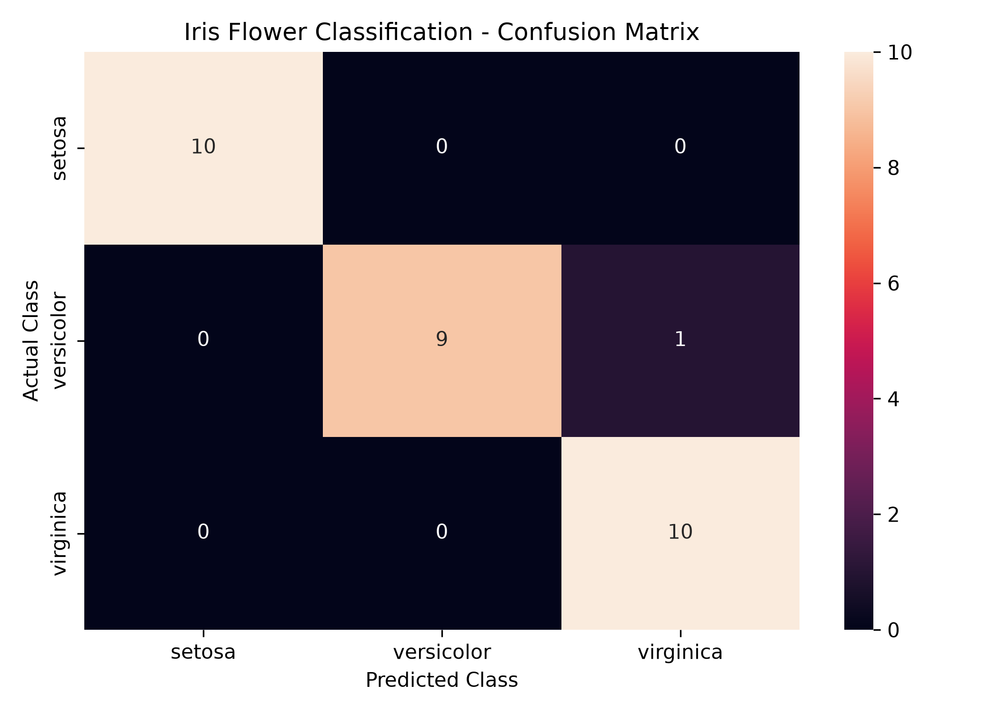
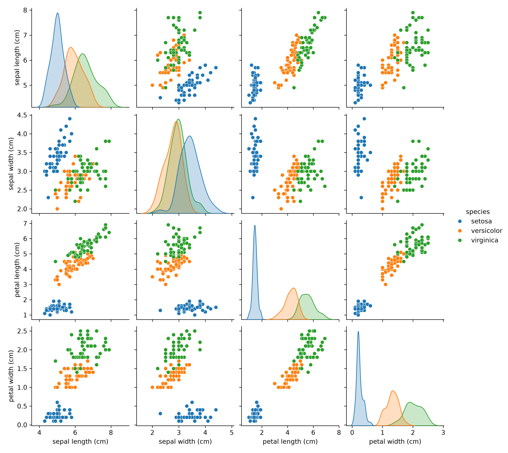
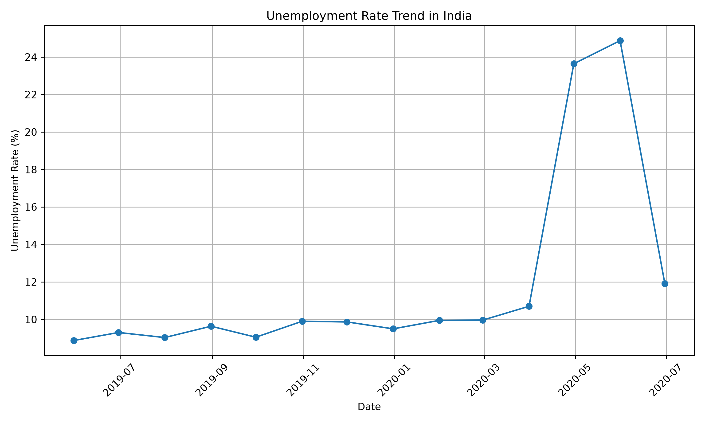
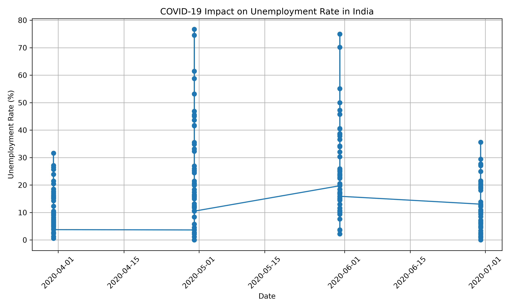
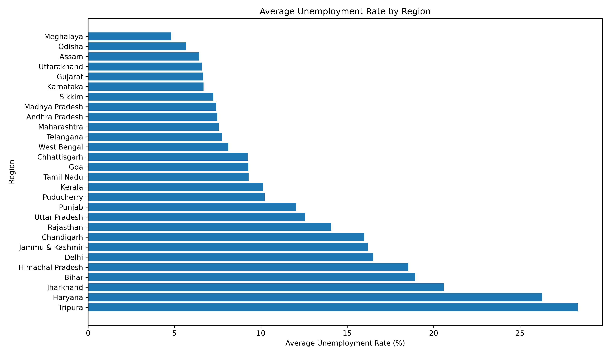
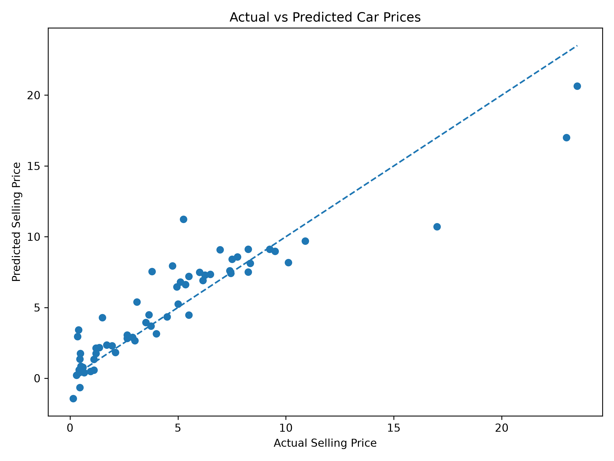
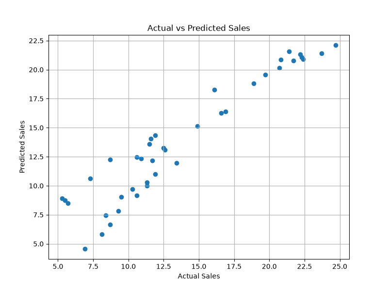
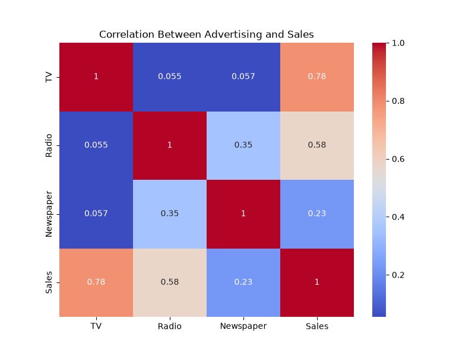

# CodeAlpha Data Science Internship


## 📌 About the Internship

This repository contains the projects completed as part of the **CodeAlpha Data Science Internship**.

The internship provided practical experience in:

- Data Analysis
- Data Preprocessing
- Exploratory Data Analysis
- Data Visualization
- Machine Learning
- Regression
- Classification
- Model Evaluation

---

# 📂 Projects

## 1️⃣ Iris Flower Classification

### Objective
Build a machine learning model to classify iris flowers into different species based on their measurements.

### Techniques
- Data preprocessing
- Train-test split
- Logistic Regression
- Classification report
- Confusion Matrix
- Data visualization

### Dataset
Iris Dataset

### Model
**Logistic Regression**

### Visualizations





---

## 2️⃣ Unemployment Analysis

### Objective
Analyze unemployment trends in India and study the impact of COVID-19 on unemployment.

### Analysis
- Data cleaning
- Missing value handling
- Time-series trend analysis
- COVID-19 impact analysis
- Region-wise unemployment analysis
- Data visualization

### Technologies
- Pandas
- NumPy
- Matplotlib
- Seaborn

### Visualizations







---

## 3️⃣ Car Price Prediction

### Objective
Predict the selling price of used cars using machine learning.

### Features
- Year
- Present Price
- Driven Kilometers
- Fuel Type
- Selling Type
- Transmission
- Owner

### Techniques
- Data preprocessing
- One-hot encoding
- Feature selection
- Train-test split
- Linear Regression

### Model Performance

| Metric | Score |
|---|---:|
| MAE | 1.22 |
| RMSE | 1.87 |
| R² Score | 0.85 |

### Visualization



---

## 4️⃣ Sales Prediction

### Objective
Predict sales based on advertising expenditure using machine learning.

### Features
- TV Advertising
- Radio Advertising
- Newspaper Advertising

### Target
**Sales**

### Model
**Linear Regression**

### Model Performance

| Metric | Score |
|---|---:|
| MAE | 1.46 |
| RMSE | 1.78 |
| R² Score | 0.90 |

### Advertising Impact

| Channel | Coefficient |
|---|---:|
| TV | 0.045 |
| Radio | 0.189 |
| Newspaper | 0.003 |

### Visualizations





---

# 🛠️ Technologies Used

- **Python**
- **Pandas**
- **NumPy**
- **Matplotlib**
- **Seaborn**
- **Scikit-learn**
- **Git**
- **GitHub**

---

# 📁 Project Structure

```text
CodeAlpha_DataScience_Internship/
│
├── README.md
├── .gitignore
│
├── Task1_Iris_Classification/
│   ├── iris_classification.py
│   ├── Readme.md
│   └── images/
│
├── Task2_Unemployment_Analysis/
│   ├── Unemployment in India.csv
│   ├── unemployment_analysis.py
│   ├── README.md
│   └── images/
│
├── Task3_Car_Price_Prediction/
│   ├── car data.csv
│   ├── car_price_prediction.py
│   ├── README.md
│   └── images/
│
└── Task4_Sales_Prediction/
    ├── Advertising.csv
    ├── sales_prediction.py
    ├── README.md
    └── images/

**complete data science workflow:**

Data Collection
      ↓
Data Cleaning
      ↓
Data Preprocessing
      ↓
Exploratory Data Analysis
      ↓
Data Visualization
      ↓
Feature Selection
      ↓
Machine Learning
      ↓
Model Evaluation
      ↓
Insights & Conclusions
